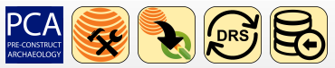

PCA Geomax Survey Processing is an internal QGIS Plugin specifically built for PCA survey data management and processing purposes.

It is a component of the new DRS/GIS integrated data management system, and it is based both in the new Geomax codelist system and in the raw survey data exported on shapefile format. 

The current version of the plugin is compatible with the Geomax codelist version draft 4.2. A dedicated help in the toolbar provides more inforamtions and detailed use procedure.

